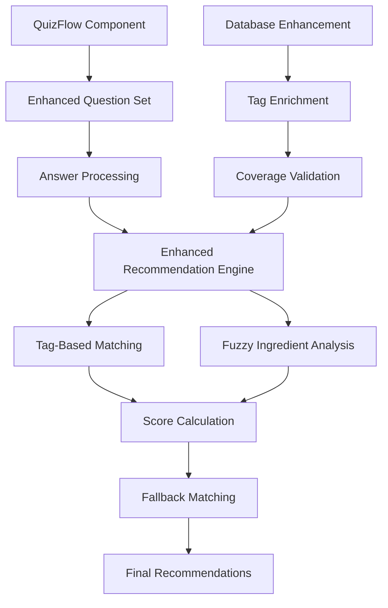

# Enhanced Quiz Coverage Design Document

## Overview

The Enhanced Quiz Coverage feature transforms the current binary quiz system into a comprehensive three-option quiz that provides complete coverage of all possible user preference combinations. This enhancement addresses the current limitation where certain preference combinations may not yield relevant cocktail recommendations by implementing fuzzy matching algorithms and enriching the cocktail database with missing tags.

The system currently supports 2×2×2×2×4 = 64 possible combinations but will expand to 3×3×3×2×4 = 216 combinations, ensuring every user receives meaningful recommendations regardless of their specific preferences.

## Architecture

### Current System Analysis
The existing quiz system consists of:
- **QuizFlow Component**: Handles user interaction and question progression
- **Recommendation Engine**: Processes quiz answers and generates cocktail matches
- **Cocktail Database**: JSON-based data with flavor_tags, mood_tags, and ingredient lists
- **Type System**: Defines QuizAnswers interface with binary options

### Enhanced System Architecture



## Components and Interfaces

### 1. Enhanced Quiz Questions

**Design Decision**: Expand from binary to ternary options while maintaining the luxury aesthetic and user experience flow.

**Rationale**: Three options provide better granularity for user preferences without overwhelming choice paralysis. The middle option captures users who don't strongly lean toward either extreme.

#### Updated Question Structure:
```typescript
interface EnhancedQuizQuestion extends QuizQuestion {
  options: [
    { label: string; value: string; colorTheme: string; tags: string[] },
    { label: string; value: string; colorTheme: string; tags: string[] },
    { label: string; value: string; colorTheme: string; tags: string[] }
  ];
}
```

#### Question Modifications:
1. **Flavor Preference**: 
   - Sweet & Luxurious (existing)
   - Bitter & Sophisticated (existing) 
   - **NEW**: Balanced & Harmonious

2. **Fruit Family**:
   - Citrus & Bright (existing)
   - **MODIFIED**: Stone Fruit & Rich (expanded from generic)
   - **NEW**: Tropical & Exotic

3. **Indulgence Style**:
   - Light & Refreshing (existing)
   - Bold & Spirit-Forward (existing)
   - **NEW**: Medium & Versatile

### 2. Enhanced Recommendation Engine

**Design Decision**: Implement a multi-tier matching system that prioritizes exact tag matches but gracefully falls back to fuzzy ingredient analysis.

**Rationale**: This approach maintains the current high-quality experience for well-tagged cocktails while ensuring comprehensive coverage through intelligent ingredient analysis.

#### Matching Algorithm Hierarchy:
1. **Primary Matching**: Direct tag-based scoring (existing system enhanced)
2. **Fuzzy Matching**: Ingredient analysis for missing tags
3. **Fallback Matching**: Similar profile matching with 85%+ scores

#### Fuzzy Matching Implementation:

```typescript
interface FuzzyMatchingRules {
  sweetness: {
    indicators: string[];
    weight: number;
  };
  fruitFamily: {
    citrus: string[];
    stone: string[];
    tropical: string[];
  };
  intensity: {
    light: string[];
    medium: string[];
    boozy: string[];
  };
}
```

**Sweet Indicators**: simple syrup, honey, agave, cream, chocolate, vanilla, caramel, sugar, grenadine, amaretto, baileys

**Stone Fruit Indicators**: peach, apricot, plum, cherry, brandied cherry, brandy-based spirits

**Tropical Indicators**: pineapple, coconut, mango, passion fruit, guava, rum-based cocktails

**Balanced Indicators**: Cocktails without extreme sweet/bitter tags, vermouth-based drinks, equal-part cocktails

### 3. Database Enhancement Strategy

**Design Decision**: Implement a systematic tagging enhancement that analyzes existing cocktails and adds missing tags based on ingredient analysis.

**Rationale**: Rather than manually retagging 100+ cocktails, an automated analysis ensures consistency and completeness while maintaining the existing tag structure.

#### Enhancement Process:
1. **Ingredient Analysis**: Parse each cocktail's ingredient list
2. **Tag Inference**: Apply fuzzy matching rules to infer missing tags
3. **Validation**: Ensure each of the 216 combinations has coverage
4. **Quality Assurance**: Maintain existing tag patterns and naming conventions

#### Coverage Matrix Validation:
```
Flavor (3) × Fruit (3) × Style (3) × Classic/Modern (2) × Mood (4) = 216 combinations
```

Each combination must have at least one cocktail with a match score ≥ 85%.

## Data Models

### Enhanced QuizAnswers Interface
```typescript
interface EnhancedQuizAnswers {
  sweetVsBitter: 'sweet' | 'bitter' | 'balanced';
  citrusVsStone: 'citrus' | 'stone' | 'tropical';
  lightVsBoozy: 'light' | 'boozy' | 'medium';
  classicVsExperimental: 'classic' | 'experimental' | 'modern';
  moodPreference: 'celebratory' | 'elegant' | 'cozy' | 'adventurous';
}
```

### Enhanced Cocktail Model
The existing Cocktail interface remains unchanged, but the flavor_tags array will be enriched with new tags:

**New Flavor Tags**:
- `balanced`, `harmonious`
- `stone`, `tropical` 
- `medium`, `versatile`

### Fuzzy Matching Metadata
```typescript
interface FuzzyMatchResult {
  cocktail: Cocktail;
  score: number;
  matchingFactors: number;
  fuzzyMatches: string[]; // Which fuzzy rules were applied
  fallbackUsed: boolean;
}
```

## Error Handling

### Graceful Degradation Strategy

**No Matches Found**: 
- Fall back to similar flavor profiles with relaxed scoring
- Ensure minimum 85% match score for magical user experience
- Log analytics events for coverage gap analysis

**Partial Matches**:
- Prioritize cocktails with most matching characteristics
- Apply bonus scoring for multiple matching factors
- Maintain recommendation quality thresholds

**Database Inconsistencies**:
- Validate tag consistency during enhancement process
- Implement tag normalization for common variations
- Provide fallback to ingredient-based matching

### Analytics and Monitoring

**Coverage Tracking**:
- Monitor which combinations use fuzzy matching
- Track recommendation quality scores by combination
- Identify gaps for future database improvements

**User Experience Metrics**:
- Quiz completion rates with new three-option format
- Recommendation satisfaction scores
- Time spent on each question

## Testing Strategy

### Unit Testing
- **Fuzzy Matching Functions**: Test ingredient analysis accuracy
- **Score Calculation**: Verify scoring algorithm consistency
- **Tag Enhancement**: Validate automated tagging logic

### Integration Testing
- **Complete Quiz Flows**: Test all 216 possible combinations
- **Recommendation Quality**: Ensure match scores remain 85-98%
- **Performance**: Maintain <500ms recommendation generation

### Coverage Validation Testing
- **Combination Matrix**: Automated testing of all 216 combinations
- **Quality Thresholds**: Verify each combination yields relevant results
- **Fallback Scenarios**: Test fuzzy matching edge cases

### User Experience Testing
- **Visual Layout**: Ensure three-option layout maintains elegance
- **Color Theme Cycling**: Verify luxury themes cycle appropriately
- **Animation Timing**: Maintain smooth transitions with new options

## Performance Considerations

### Optimization Strategies

**Caching**: 
- Pre-calculate fuzzy matching scores for common ingredient patterns
- Cache combination-to-cocktail mappings for frequent queries

**Lazy Loading**:
- Load fuzzy matching rules only when exact matches fail
- Defer complex ingredient analysis until needed

**Score Calculation Efficiency**:
- Optimize scoring algorithm to minimize computational overhead
- Use early termination for clearly non-matching cocktails

### Memory Management
- Maintain existing JSON-based data structure for simplicity
- Consider indexed lookups for large-scale fuzzy matching operations

## Security and Privacy

### Data Handling
- No changes to existing privacy model
- Enhanced analytics tracking follows existing patterns
- No sensitive user data collection beyond current quiz answers

### Input Validation
- Validate quiz answers against expected enum values
- Sanitize any user input in analytics tracking
- Maintain existing XSS protection patterns

## Migration Strategy

### Backward Compatibility
- Existing QuizAnswers interface remains compatible
- New third options are additive, not breaking changes
- Current recommendation engine logic enhanced, not replaced

### Deployment Approach
1. **Phase 1**: Deploy enhanced recommendation engine with fuzzy matching
2. **Phase 2**: Update quiz UI with three-option questions
3. **Phase 3**: Implement database tag enhancements
4. **Phase 4**: Enable comprehensive coverage validation

### Rollback Plan
- Feature flags for new quiz options
- Ability to revert to binary questions if needed
- Separate deployment of recommendation engine enhancements

## Success Metrics

### Primary KPIs
- **Coverage Completeness**: 100% of 216 combinations yield recommendations
- **Recommendation Quality**: Maintain 90%+ average match scores
- **User Engagement**: Quiz completion rates ≥ current baseline

### Secondary Metrics
- **Fuzzy Matching Usage**: Track percentage of recommendations using fallback logic
- **Performance**: Recommendation generation time <500ms
- **User Satisfaction**: Qualitative feedback on recommendation relevance

This design ensures the enhanced quiz system provides comprehensive coverage while maintaining the luxury user experience and high-quality recommendations that define the current system.