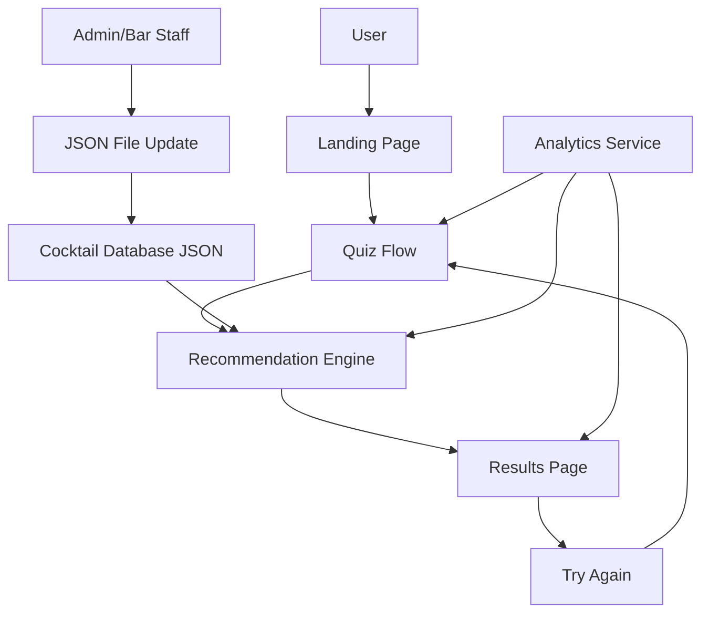

# Design Document

## Overview

The Secret Cocktail Menu App is a Progressive Web App (PWA) built with modern web technologies to deliver a fast, mobile-first experience for cocktail discovery. The app uses a gamified quiz interface to collect user preferences and matches them against a rich cocktail database using a weighted scoring algorithm. The architecture prioritizes simplicity, performance, and ease of content management.

## Architecture

### Technology Stack
- **Frontend**: React with TypeScript for type safety and maintainability
- **Styling**: Tailwind CSS with custom premium design system (Tesla/Rolex-inspired minimalism)
- **State Management**: React Context API for quiz state and recommendations
- **Data Storage**: Static JSON file for cocktail data (easily replaceable with API)
- **Build Tool**: Vite for fast development and optimized production builds
- **Deployment**: Vercel for automatic deployments and global CDN
- **Analytics**: Google Analytics 4 for tracking user interactions
- **PWA Features**: Service Worker for offline capability and app-like experience

### System Architecture



## Components and Interfaces

### Core Components

#### 1. Landing Page Component
- **Purpose**: Premium welcome experience with magical, high-end aesthetic
- **Props**: None
- **State**: None
- **Features**: 
  - Tesla/Rolex-inspired minimalist luxury design
  - Subtle animations and micro-interactions
  - Premium typography with elegant spacing
  - Magical visual elements (subtle gradients, refined shadows)
  - Gracious, complimentary welcome copy

#### 2. Quiz Flow Component
- **Purpose**: Magical preference discovery journey with premium interactions
- **Props**: `onComplete: (answers: QuizAnswers) => void`
- **State**: `currentQuestion: number`, `answers: QuizAnswers`
- **Features**:
  - Single question per screen with cinematic transitions
  - Premium button designs with subtle hover/tap effects
  - Elegant progress indicator (think Harry Potter spell casting)
  - Smooth, magical transitions between questions
  - Sophisticated color palettes for each flavor category
  - Complimentary, gracious copy that celebrates user choices
  - "Excellent choice!" and "How refined of you!" style feedback

#### 3. Recommendation Engine
- **Purpose**: Core algorithm for matching user preferences to cocktails
- **Input**: `QuizAnswers` object
- **Output**: `RecommendationResult` with primary + adjacent cocktails
- **Algorithm**: Weighted scoring based on flavor_tags, mood_tags, and user preferences

#### 4. Results Display Component
- **Purpose**: Magical reveal of personalized cocktail destiny
- **Props**: `recommendations: RecommendationResult`
- **Features**:
  - Cinematic hero cocktail reveal with premium presentation
  - Elegant carousel for adjacent recommendations
  - Beautifully formatted ingredient lists with premium typography
  - Gracious, complimentary copy: "Your impeccable taste has led us to..."
  - "Discover Another Masterpiece" instead of "Try Another"
  - Subtle magical animations for the reveal moment

### Data Interfaces

```typescript
interface Cocktail {
  id: string;
  name: string;
  base_spirit_category: string;
  base_brand: string;
  style: string;
  build_type: string;
  flavor_tags: string[];
  mood_tags: string[];
  ingredients: string[];
  garnish: string;
  glassware: string;
  notes: string;
}

interface QuizAnswers {
  sweetVsBitter: 'sweet' | 'bitter';
  citrusVsStone: 'citrus' | 'stone';
  lightVsBoozy: 'light' | 'boozy';
  classicVsExperimental: 'classic' | 'experimental';
  spiritPreference?: string;
  moodPreference?: string;
}

interface RecommendationResult {
  primary: Cocktail;
  adjacent: Cocktail[];
  matchScore: number;
}
```

## Data Models

### Quiz Question Configuration
```typescript
interface QuizQuestion {
  id: string;
  question: string;
  options: {
    label: string;
    value: string;
    colorTheme: string;
    tags: string[];
  }[];
  category: 'flavor' | 'mood' | 'spirit' | 'style';
}
```

### Recommendation Scoring Model
The recommendation engine uses a weighted scoring system:

1. **Flavor Tag Matching** (40% weight)
   - Direct tag matches get full points
   - Related tags get partial points
   - Opposite tags get negative points

2. **Mood Tag Matching** (30% weight)
   - Matches user's selected mood preferences
   - Considers complementary moods

3. **Spirit Preference** (20% weight)
   - Matches base_spirit_category if specified
   - Considers user's light vs boozy preference

4. **Style Preference** (10% weight)
   - Classic vs experimental preference
   - Build type preferences (shaken vs stirred, etc.)

## Error Handling

### Client-Side Error Handling
- **Network Failures**: Graceful degradation with cached data
- **Invalid Quiz Responses**: Validation with user-friendly messages
- **Missing Cocktail Data**: Fallback to default recommendations
- **Analytics Failures**: Silent failure, don't block user experience

### Data Validation
- **Cocktail Data**: Schema validation on app initialization
- **Quiz Answers**: Type checking and completeness validation
- **Recommendation Results**: Ensure minimum number of results

### User Experience Error States
- Loading states for all async operations
- Empty states when no recommendations found
- Retry mechanisms for failed operations
- Clear error messages in user-friendly language

## Testing Strategy

### Unit Testing
- **Quiz Logic**: Test question flow and answer collection
- **Recommendation Engine**: Test scoring algorithm with known inputs
- **Component Rendering**: Test all UI components in isolation
- **Data Validation**: Test cocktail data schema validation

### Integration Testing
- **Quiz to Recommendations Flow**: End-to-end user journey
- **Analytics Integration**: Verify event tracking
- **PWA Features**: Test offline functionality and installation

### Performance Testing
- **Load Time**: Target <3 seconds on 3G connections
- **Bundle Size**: Keep JavaScript bundle under 200KB
- **Image Optimization**: Compress all visual assets
- **Lighthouse Scores**: Target 90+ for Performance, Accessibility, SEO

### User Acceptance Testing
- **Mobile Usability**: Test on various device sizes
- **Bar Environment**: Test in low-light conditions
- **Touch Interactions**: Verify button sizes and tap targets
- **Quiz Flow**: Ensure intuitive progression through questions

### Analytics Testing
- **Event Tracking**: Verify quiz starts, completions, and recommendations
- **Conversion Funnel**: Track user drop-off points
- **Popular Cocktails**: Monitor most recommended drinks
- **Performance Metrics**: Track load times and user engagement
#
# Design System & Visual Identity

### Premium Aesthetic Guidelines
- **Visual Inspiration**: Tesla's minimalist luxury, Rolex's refined elegance, Harry Potter's magical sophistication
- **Color Palette**: Deep, rich tones with subtle gradients and premium metallics
- **Typography**: Clean, modern fonts with generous spacing and elegant hierarchy
- **Animations**: Subtle, purposeful micro-interactions that feel magical but refined
- **Shadows & Depth**: Sophisticated layering that creates premium depth without clutter

### Language & Copy Guidelines
- **Tone**: Gracious, complimentary, and subtly humorous
- **User Validation**: Celebrate every user choice as refined and excellent
- **Examples**:
  - "Your impeccable taste has led us to this exquisite creation..."
  - "How wonderfully sophisticated of you to choose..."
  - "A choice that speaks to your refined palate..."
  - "Discover Another Masterpiece" (instead of "Try Another")
  - "Your Cocktail Destiny Awaits" (instead of generic loading)

### Magical UX Elements
- **Loading States**: "Consulting the spirits..." or "Crafting your perfect match..."
- **Transitions**: Smooth, cinematic reveals that feel like magic happening
- **Feedback**: Immediate, delightful responses to user interactions
- **Progressive Disclosure**: Information reveals that build anticipation
- **Micro-Interactions**: Subtle animations that respond to user touch/hover

### Premium Mobile Experience
- **Touch Targets**: Generously sized for elegant interaction
- **Gestures**: Smooth swipe interactions with premium feel
- **Haptic Feedback**: Subtle vibrations for premium mobile devices
- **Responsive Design**: Flawless across all device sizes with consistent luxury feel