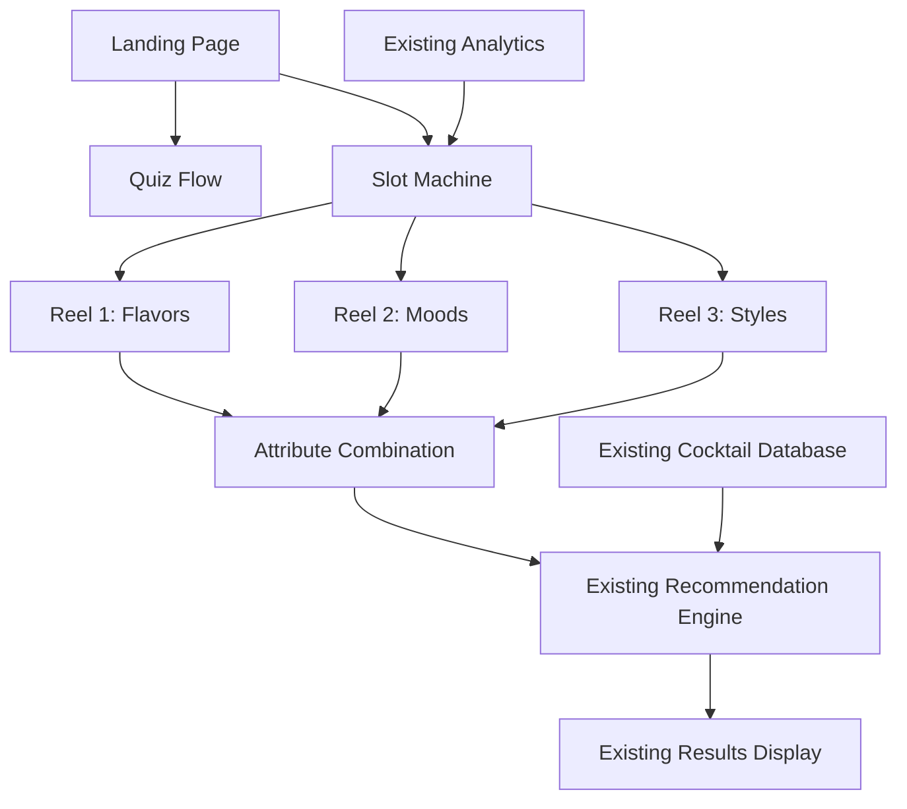

# Design Document

## Overview

The Secret Shuffle feature extends the existing Secret Cocktail Menu App with an interactive three-reel slot machine interface. Users tap the screen three times to stop spinning reels that contain flavor attributes, mood attributes, and style preferences. The selected combination is then processed through the existing recommendation engine to find matching cocktails. This feature maintains the same premium aesthetic and uses the existing cocktail database and recommendation logic.

## Architecture

### Integration with Existing System
The Secret Shuffle feature integrates seamlessly with the current architecture:

- **Shared Components**: Uses existing Results display, cocktail database, and recommendation engine
- **New Route**: Adds `/shuffle` route alongside existing `/` and `/quiz` routes
- **Shared State**: Leverages existing analytics and performance services
- **Consistent Styling**: Maintains Tesla/Rolex-inspired premium design system

### Technology Stack (Additions)
- **Animation Library**: CSS animations with easing functions for mechanical slot machine physics
- **State Management**: React useState for reel states and spinning logic
- **Timing Control**: JavaScript setTimeout/setInterval for staggered reel stopping
- **Physics Simulation**: Custom easing functions to simulate mechanical deceleration

### System Architecture



## Components and Interfaces

### New Components

#### 1. SlotMachine Component
- **Purpose**: Main slot machine interface with three spinning reels
- **Props**: `onComplete: (attributes: SlotMachineResult) => void`
- **State**: 
  - `reelStates: ReelState[]` - spinning/stopping/stopped for each reel
  - `selectedAttributes: string[]` - final selected attributes
  - `currentTap: number` - which reel to stop next (1-3)
- **Features**:
  - Three simultaneous spinning reels
  - Tap-to-stop interaction with mechanical deceleration
  - Premium slot machine styling with authentic physics
  - Clear tap instructions and progress indication

#### 2. SlotReel Component
- **Purpose**: Individual spinning reel with mechanical physics
- **Props**: 
  - `attributes: string[]` - list of attributes to cycle through
  - `isSpinning: boolean` - current spinning state
  - `onStop: (selectedAttribute: string) => void` - callback when reel stops
  - `reelIndex: number` - for staggered animations
- **State**:
  - `currentIndex: number` - which attribute is currently visible
  - `isDecelerating: boolean` - mechanical slowdown state
- **Features**:
  - Smooth 60fps spinning animation
  - Realistic mechanical deceleration (1-2 seconds)
  - Bounce/settle effect when stopping
  - Premium visual styling with depth and shadows

#### 3. SlotMachineResults Component
- **Purpose**: Bridge between slot machine results and existing results display
- **Props**: `slotResult: SlotMachineResult`
- **Features**:
  - Shows selected attribute combination
  - Converts slot results to quiz-compatible format
  - Passes to existing Results component
  - "Spin Again" and "Take Quiz Instead" options

### Data Interfaces

```typescript
interface SlotMachineResult {
  flavor: string;
  mood: string;
  style: string;
  timestamp: number;
}

interface ReelState {
  isSpinning: boolean;
  isDecelerating: boolean;
  currentAttribute: string;
  finalAttribute?: string;
}

interface SlotMachineAttributes {
  flavors: string[];
  moods: string[];
  styles: string[];
}
```

### Attribute Mapping

#### Flavor Attributes (Reel 1)
```typescript
const FLAVOR_ATTRIBUTES = [
  'sweet', 'bitter', 'citrus', 'herbal', 'spicy', 
  'fruity', 'floral', 'smoky', 'creamy', 'tart'
];
```

#### Mood Attributes (Reel 2)
```typescript
const MOOD_ATTRIBUTES = [
  'adventurous', 'elegant', 'playful', 'cozy', 'celebratory',
  'sophisticated', 'bold', 'refreshing', 'mysterious', 'classic'
];
```

#### Style Attributes (Reel 3)
```typescript
const STYLE_ATTRIBUTES = [
  'classic', 'experimental', 'light', 'boozy', 'shaken',
  'stirred', 'built', 'tropical', 'seasonal', 'premium'
];
```

## Slot Machine Physics and Animation

### Spinning Animation
- **Speed**: Consistent rotation speed across all reels
- **Visual**: Smooth blur effect during high-speed spinning
- **Physics**: Linear animation with no deceleration while spinning

### Mechanical Deceleration
- **Trigger**: User tap initiates gradual slowdown
- **Duration**: 1-2 seconds for realistic mechanical feel
- **Easing**: Custom cubic-bezier curve mimicking real slot machine physics
- **Settle Effect**: Slight bounce/overshoot when stopping for authenticity

### CSS Animation Example
```css
.reel-spinning {
  animation: spin 0.1s linear infinite;
}

.reel-decelerating {
  animation: decelerate 1.5s cubic-bezier(0.25, 0.46, 0.45, 0.94) forwards;
}

@keyframes decelerate {
  0% { transform: translateY(0); }
  90% { transform: translateY(-10px); }
  100% { transform: translateY(0); }
}
```

## Integration with Existing Systems

### Recommendation Engine Integration
The slot machine results are converted to match the existing quiz format:

```typescript
function convertSlotToQuizAnswers(slotResult: SlotMachineResult): QuizAnswers {
  return {
    sweetVsBitter: slotResult.flavor.includes('sweet') ? 'sweet' : 'bitter',
    citrusVsStone: slotResult.flavor.includes('citrus') ? 'citrus' : 'stone',
    lightVsBoozy: slotResult.style.includes('light') ? 'light' : 'boozy',
    classicVsExperimental: slotResult.style.includes('classic') ? 'classic' : 'experimental',
    moodPreference: slotResult.mood,
    // Additional mapping logic for complex attributes
  };
}
```

### Analytics Integration
New analytics events for slot machine usage:

```typescript
// Slot machine specific events
trackEvent('slot_machine_started');
trackEvent('reel_stopped', { reelIndex: 1, attribute: 'citrus' });
trackEvent('slot_machine_completed', { 
  combination: ['citrus', 'adventurous', 'classic'],
  matchedCocktail: 'Gin & Tonic'
});
trackEvent('spin_again_clicked');
```

### Navigation Integration
Update existing routing to include slot machine:

```typescript
// Add to existing router
<Route path="/shuffle" element={<SlotMachine />} />

// Update landing page with both options
<Button onClick={() => navigate('/quiz')}>Take Quiz</Button>
<Button onClick={() => navigate('/shuffle')}>Surprise Me</Button>
```

## Error Handling

### Slot Machine Specific Errors
- **Animation Failures**: Fallback to instant selection if animations fail
- **Timing Issues**: Ensure reels always stop even if timing is disrupted
- **Attribute Selection**: Validate that each reel selects a valid attribute
- **State Synchronization**: Handle edge cases where reel states become inconsistent

### Graceful Degradation
- **Reduced Motion**: Respect user's motion preferences with simpler animations
- **Performance Issues**: Fallback to simpler animations on slower devices
- **Touch Issues**: Ensure tap detection works reliably across devices

## Testing Strategy

### Slot Machine Specific Tests

#### Unit Testing
- **Reel Physics**: Test mechanical deceleration timing and easing
- **Attribute Selection**: Verify random selection works correctly
- **State Management**: Test reel state transitions (spinning → decelerating → stopped)
- **Integration**: Test conversion from slot results to quiz format

#### Animation Testing
- **Performance**: Ensure 60fps during spinning animations
- **Timing**: Verify deceleration takes 1-2 seconds consistently
- **Visual**: Test that reels appear to spin smoothly
- **Responsiveness**: Verify tap detection works during spinning

#### User Experience Testing
- **Three-Tap Flow**: Test complete user journey through all three reels
- **Visual Feedback**: Ensure clear indication of which reel to tap next
- **Results Integration**: Verify smooth transition to results display
- **Repeat Usage**: Test "Spin Again" functionality

### Cross-Feature Testing
- **Navigation**: Test switching between quiz and slot machine
- **Results Consistency**: Verify both features use same results display
- **Analytics**: Ensure both features track to same analytics system
- **Performance**: Test that adding slot machine doesn't impact quiz performance

## Premium Design System Integration

### Visual Consistency
- **Color Palette**: Use same premium colors as existing app
- **Typography**: Maintain elegant font hierarchy
- **Shadows and Depth**: Apply same sophisticated layering
- **Animations**: Keep magical, refined micro-interactions

### Slot Machine Specific Styling
- **Reel Design**: Premium metallic appearance with subtle gradients
- **Spinning Effect**: Elegant motion blur during high-speed rotation
- **Attribute Display**: Beautiful typography for attribute names
- **Progress Indication**: Sophisticated visual cues for tap sequence

### Language and Copy
- **Instructions**: "Tap to stop each reel and discover your cocktail destiny"
- **Reel Labels**: "Flavors", "Moods", "Styles" with elegant styling
- **Results**: "The reels have aligned! Your combination of [attributes] reveals..."
- **Actions**: "Spin Again" and "Try the Quiz Instead"

## Performance Considerations

### Animation Optimization
- **GPU Acceleration**: Use transform3d for hardware acceleration
- **Frame Rate**: Maintain 60fps during all animations
- **Memory Management**: Clean up animation timers properly
- **Battery Impact**: Optimize for mobile battery life

### Bundle Size Impact
- **Minimal Addition**: Reuse existing components and utilities
- **Code Splitting**: Lazy load slot machine components
- **Asset Optimization**: Compress any new images or sounds
- **Tree Shaking**: Ensure unused code is eliminated

This design maintains the premium experience while adding an engaging new discovery method that feels authentic and magical.